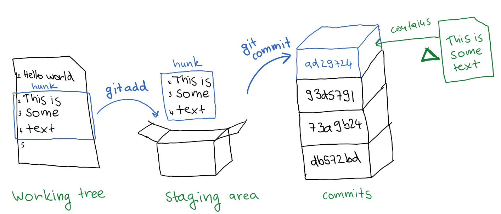

Git tutorial summary
====================
Here is a summary of a COG talk on Git that took place online, an 2020-03-17.

## Useful concepts we talked about
- analogy with working tree (papers on desk), staging area (shoe box to which I copy file snippets), and repository (stack of such shoe boxes)

- remote repositories -> these do not have a working tree and are initialised with `git init --bare` or online, e.g. via GitHub.

__Use command line in the beginning – it will make you understand!__

## Useful links
### THE ABSOLUTELY MUST-HAVE USEFUL LINKS
- git playground, will make you understand concepts, displays graph [https://git.sergiocabral.com/]
- most useful tutorial for all the commands (refer to previous sections in this too) [https://www.atlassian.com/git/tutorials/advanced-overview]
- undoing mistakes with some profanity [https://ohshitgit.com/]

### Some other links people asked for
- setting up a local server [https://git-scm.com/book/en/v2/Git-on-the-Server-Setting-Up-the-Server]
- one way of making own "backups" of the whole history, answers question [https://dev.to/sublimegeek/how-to-zombie-proof-your-git-repo-4oed]
- set up LabVIEW with git [https://www.youtube.com/watch?v=ZvV-ja1h6DE&feature=youtu.be&t=1555]
- git aliases and the bible of references [https://git-scm.com/book/en/v2/Git-Basics-Git-Aliases]

## Useful commands to get you started
- git init
- git add
- git commit (will prompt you to)

### To know what you are doing
- _git log_
- _git status_

## To use branches / collaborate
- git branch
- git checkout -> change contents of the files in your working tree (folder) to be as in a commit or a branch - this is SAFE, it will not allow you to do so if you have uncommited changes
- git merge
- git rebase

## To access remote
- git push -> pushes changes
- git pull -> get changes
- git fetch -> get changes from remote, but do not checkout them or change files in your   

## Extremely useful tools
- git stash
- git reset
- git reflog
- git tag
- git blame
- git bisect
- git hooks

## Looking at differences
- git diff (basically the GNU diff uitility)
- meld (visual tool, my favourite, even for files outside of git)
- any of the frontend tools

## Configurations
- levels
	1. system (rarely used)
	2. global (in home folder of user) -> file `gitconfig` or `.gitconfig`
	3. local -> in `.git/config`
- overrides in descending order, i.e. local > global > system
- .gitignore must 

### Useful aliases
	git config --global alias.adog 'log --all --decorate --oneline --graph'
or add it in your config file under `[aliases]`
	adog = log --all --decorate --oneline --graph

## Front-ends
- Github clent
- sourcetree (developed by Bitbucket)
- sublime merge (my favourite, integrates with sublime-text and shares same ideology, _powerful, but hacky_)
- tortoise git - in LabVIEW tutorial
- MATLAB - access via file browser panel (initialise via command line in the folder to show)
- meld - diffs

## Online services
- Github - ucl has 'pro' account which allows more private collaborators and unlimited private repos, open-source standard
- Bitbucket - simple, unlimited collaborators for free (less features then Github but mostly sufficient, no ssh key access though)
- Gitlab - self hosted, fully-integrated, user friendly, industry standard

## Handling large files
- git-annex - git solution for truly decentralised storage
- git-lfs - plugin for storing large files, possibly on external servers - _built by GitHub, mainly targeted at GitHub integration - somewhat difficult to use standalone_
- (see section "similar software" and "what git-annex is not" of git-annex website for many more solutions!) 

